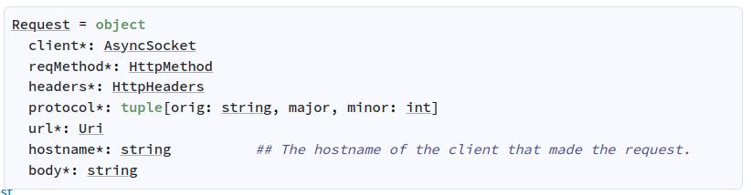
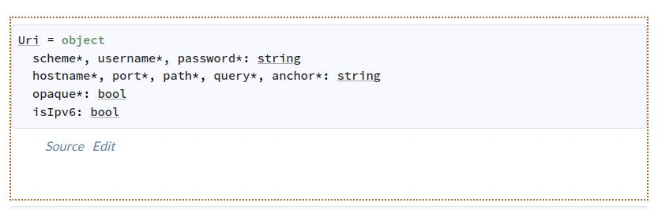

# 👑Nimでローカルで動く静的ファイルサーバーを作ろう👑


---

## 今回学べること
- NimでWebサーバーを建てられること
- NimでOSのファイルシステムを扱えること
- Nimの標準ライブラリのドキュメントの読み方
- Nimの3rdパーティのライブラリの使い方

---

## 環境構築

```sh
curl https://nim-lang.org/choosenim/init.sh -sSf | sh
```

---

こういうコマンドを作る
```sh
localserver -h

Usage:
  localserver [optional-params] 
Options:
  -h, --help                print this cligen-erated help
  --help-syntax             advanced: prepend,plurals,..
  -p=, --port=   int  8080  set port

```
```
localserver -p=8080
> start server on localhost:8080
```

---

# プロジェクト作成

----

```sh
nimble init
```
対話型で聞かれるので質問に答えていく

`Package type?` では `binary`を選択してください。
後はほとんどEnterでOK

---

# Hello World

---

src/hello.nim
```nim
echo "Hello Wolrd"
```

コマンドで実行
```sh
nim c -r src/hello.nim
```

---

# httpserverを作る

---

標準ライブラリのasynchttpserverに書いてる内容をまるっとコピペ
https://nim-lang.org/docs/asynchttpserver.html

src/localserver/server.nim
```nim
import std/asynchttpserver
import std/asyncdispatch

proc main() {.async.} =
  var server = newAsyncHttpServer()
  proc cb(req: Request) {.async.} =
    echo (req.reqMethod, req.url, req.headers)
    let headers = {"Content-type": "text/plain; charset=utf-8"}
    await req.respond(Http200, "Hello World", headers.newHttpHeaders())

  server.listen(Port(0))
  let port = server.getPort
  echo "test this with: curl localhost:" & $port.uint16 & "/"
  while true:
    if server.shouldAcceptRequest():
      await server.acceptRequest(cb)
    else:
      await sleepAsync(500)

waitFor main()
```
---
```sh
nim c -r src/localserver/main.nim
```

http://localhost:8080でサーバーが立ち上がる

コマンドライン引数からポート番号を渡せるようにしたい

---
# CLIアプリを作る


---

cligenをインストール
```sh
nimble install cligen
```

nimbleファイルに依存関係を追記
```nim
requires "cligen"
```

---

src/localserver.nim
```nim
proc localserver() =
  discard

when isMainModule:
  import cligen
  dispatch(localserver)
```

---

```sh
nim c -r src/localserver.nim -h
```

CLIの説明が表示される
```
Usage:
  localserver [optional-params]
Options:
  -h, --help                print this cligen-erated help
  --help-syntax             advanced: prepend,plurals,..
```

---

```nim
proc localserver(port=8080) = # <<<<< 引数portを追加 >>>>>
  discard

when isMainModule:
  import cligen
  dispatch(localserver)
```

起動する
```sh
nim c -r src/localserver.nim -h
```

---

```
Usage:
  localserver [optional-params]
Options:
  -h, --help                print this cligen-erated help
  --help-syntax             advanced: prepend,plurals,..
  -p=, --port=   int  8080  set port
```

コマンドライン引数 `--port` の説明が追加された！

---

## ヘルプの内容を編集する

```nim
import std/tables

proc localserver(port=8080) =
  ## ローカルでサーバーを起動するコマンドです
  discard

const HELP = {"port": "ここに指定したポート番号でサーバーが起動します"}.toTable()

when isMainModule:
  import cligen
  dispatch(localserver, help=HELP)
```

---

ではコマンドライン引数からhttpserverにポート番号を渡せるようにしましょう

---

src/localserver/server.nim

```nim
proc main*(port:int) {.async.} = # <<<<< 引数 port:int を追加、*を付けてpublicにする >>>>>
  var server = newAsyncHttpServer()
  proc cb(req: Request) {.async.} =
    echo (req.reqMethod, req.url, req.headers)
    let headers = {"Content-type": "text/plain; charset=utf-8"}
    await req.respond(Http200, "Hello World", headers.newHttpHeaders())

  server.listen(Port(port)) # <<<<< 引数を渡す >>>>>
  let port = server.getPort
  echo "test this with: curl localhost:" & $port.uint16 & "/"
  while true:
    if server.shouldAcceptRequest():
      await server.acceptRequest(cb)
    else:
      await sleepAsync(500)
```

---

src/localserver.nim

```nim
import std/asyncdispatch
import std/tables
import ./localserver/server

proc localserver(port=8080) =
  ## ローカルでサーバーを起動するコマンドです
  waitFor main(port)

const HELP = {"port": "ここに指定したポート番号でサーバーが起動します"}.toTable()

when isMainModule:
  import cligen
  dispatch(localserver, help=HELP)
```

---

起動してみる

```nim
nim c -r src/localserver.nim -p 7000
nim c -r src/localserver.nim -p 8000
nim c -r src/localserver.nim -p 9000
```

---

# ファイルの中身を読む

---

「ファイルの中身を読む」という処理はIOの処理です。
ここでは非同期でファイルの読み書きをするasyncfileライブラリを使います

https://nim-lang.org/docs/asyncfile.html

---

```nim
import std/os
import std/asyncfile

let filepath = getCurrentDir() / "example/index.html"
echo filepath
let file = openAsync(filepath, fmRead)
defer: file.close()
let data = file.readAll().await
echo data
```

---

dataの中に `example/index.html` の中身を読み込めたことがわかったので、これをクライアントに返すようにする

```nim
let filepath = getCurrentDir() / "example/index.html"
let file = openAsync(filepath, fmRead)
defer: file.close()
let data = file.readAll().await
let headers = {"Content-type": "text/plaintext; charset=utf-8"}
await req.respond(Http200, data, headers.newHttpHeaders())
```

---

リクエストのURLからファイルパスを取り出して渡すようにする

```nim
let filepath = getCurrentDir() / "example/index.html"
```
 ↓
```nim
let filepath = getCurrentDir() / req.url.path
```

http://localhost:8080/example/index.html にアクセス

---

https://nim-lang.org/docs/asynchttpserver.html#Request


https://nim-lang.org/docs/uri.html#Uri


---

index.htmlの中身がplaintextで返ってきた。これをhtmlとして表示するには？

→レスポンスヘッダーの `Content-Type` を `text/html` にする

この `text/html` とか `image/jpeg` のことをMINEタイプと言う

---

# 拡張子からMINEタイプを導く

---

まずURLから拡張子を取り出します

```nim
let path = req.url.path
echo path
> /examples/index.html

ドットで分割して配列にする
let pathArr = path.split(".")
echo pathArr
> @["/example/index", "html"]

配列の一番最後を取りだす
let ext = pathArr[^1]
echo ext
> "html"
```

---

標準ライブラリの `mimetypes` ライブラリを使う
https://nim-lang.org/docs/mimetypes.html

```nim
import std/mimetypes

let ext = req.url.path.split(".")[^1]
let contentType = newMimetypes().getMimetype(ext)
echo contentType
```

---

レスポンスヘッダーに `Content-Type`をセットする
```nim
let headers = newHttpHeaders()
headers["Content-Type"] = contentType
```

---

全体像
ついでにファイルの存在確認も行う

```nim
let filePath = getCurrentDir() / req.url.path
if fileExists(filepath):
  # URLから拡張子を取り出し、拡張子からContentTypeを取りだす
  let ext = req.url.path.split(".")[^1]
  let contentType = newMimetypes().getMimetype(ext)

  # ファイルの中身を読み込む
  let file = openAsync(filepath, fmRead)
  defer: file.close()
  let data = file.readAll().await

  # レスポンスヘッダーにContent-Typeをセットする
  let headers = newHttpHeaders()
  headers["Content-Type"] = contentType

  # レスポンスを返す
  await req.respond(Http200, data, headers)

await req.respond(Http404, "")
```

---

# ファイル一覧を表示する

---

- `/`やフォルダにアクセスした時には現在のディレクトリのファイルとフォルダの一覧を表示したい
- URLの拡張子の有無で判別する

---

## 現在のフォルダのファイル一覧を返す関数を作る

os.walkDir…ファイル一覧をイテレーターで回す
https://nim-lang.org/docs/os.html#walkDir.i%2Cstring

os.PathComponent…ディレクトリにあるオブジェクトのタイプ
https://nim-lang.org/docs/os.html#PathComponent

strutils.contains…ある文字列にある文字列が含まれるかどうか
https://nim-lang.org/docs/strutils.html#contains%2Cstring%2Cstring

seq[T]…配列
https://nim-lang.org/docs/system.html#system-module-seqs

---
src/localserver/file.nim

```nim
import std/os
import std/strutils

proc getFiles*(path:string):seq[string] =
  let currentPath = getCurrentDir() / path
  var files = newSeq[string]()
  for row in walkDir(currentPath, relative=true):
    if row.kind == pcDir or row.path.contains("."):
      files.add(row.path)
  return files
```

---

src/localserver.nim
```nim
import ./files
.
.

if req.url.path.contains("."):
  .
  .
else:
  let files = getFiles(req.url.path) # 今回作った関数を呼び出す
  let headers = newHttpHeaders()
  await req.respond(Http200, $files, headers)

await req.respond(Http404, "")
```

http://localhost8080/example にアクセス
> @["index.html", "style.css"]

---

# テンプレートエンジンを使って綺麗に表示する

---

`Source Code Filters` という機能があり、これを使ってHTMLの中に変数を入れたりif文やfor文が使えます

https://nim-lang.org/docs/filters.html

---

src/localserver/view.nim
```nim
#? stdtmpl | standard
#proc displayView*(path:string, files:seq[string]): string =
<!DOCTYPE html>
<html lang="en">
<head>
  <title>Current Directory Files</title>
</head>
<body>
  # let urlPath = if path == "/": "" else: path
  <h1>Directory listing for ${path}</h1>
  <hr>
  #if files.len > 0:
    <ul>
      #for file in files:
        <li><a href="${urlPath}/${file}">${file}</a></li>
      #end for
    </ul>
  #end if
  <hr>
</body>
</html>
```

---

src/localserver.nim
```nim
import ./files
import ./view
.
.

if req.url.path.contains("."):
  .
  .
else:
  let files = getFiles(req.url.path)
  let body = displayView(req.url.path, files) # 今回作った関数を呼び出す
  let headers = newHttpHeaders()
  headers["Content-Type"] = "text/html"
  await req.respond(Http200, body, headers)

await req.respond(Http404, "")
```

---

これで処理が完成したので、ビルドしてファイル単体で動かしてみましょう

```sh
nimble install
localserver -h
localserver -p 8080
```

バイナリは `~/.nimble/bin/` にあります

---

# おまけ
## APIドキュメントを作ろう
https://nim-lang.org/docs/docgen.html

---

```sh
nim doc --project --index:on --outdir:docs src/localserver.nim
cd docs
localserver
```

http://localhost:8080/theindex.html にアクセス

---

今回のプロジェクトの、外部に公開されているpublicな関数のドキュメントが生成されました。
公式ドキュメントもこれで作られています。

---

# ドキュメントのコメントを充実させよう

---

`localserver/file.nim`の`getFile`関数にコメントを書いてみよう

- シャープ２つ「##」で始めた行がドキュメントコメントとして解釈されます。
- マークダウン記法で書けます。
- runnableExamplesの中のネストでサンプルのコードを書くことができます。
- runnableExamplesも引数の型の不一致、未定義変数の呼び出しなどでコンパイルエラーになります。

```nim
proc getFiles*(path:string):seq[string] =
  ## pathのディレクトリのファイル一覧を表示します
  ## 
  ## バイナリは除外します
  runnableExamples:
    let files = getFiles("/path/to/dir")
    echo files
    # > @["subdir", "aaa.nim", "bbb.nim"]

  # 以下実装
```

---
ファイル自体にもドキュメントを書くことができます。

src/localserver.nim
```nim
## # local server
## 現在のディレクトリのファイルを返すサーバーです。
## ```sh
## localserver -p:8080
## > start server on http://localhost:8080
## ```

import asyncdispatch
import tables
import ./localserver/server

proc localserver(port=8080) =
  ...
```

再度ドキュメント生成させて、サーバーを起動してアクセスして、どう変わったから見てみましょう

---

# おわり
